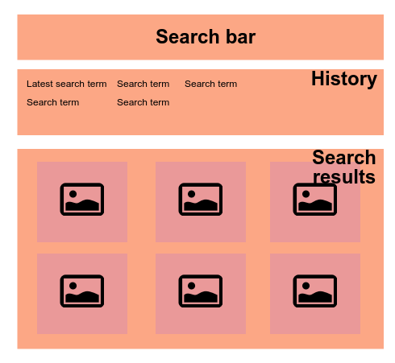
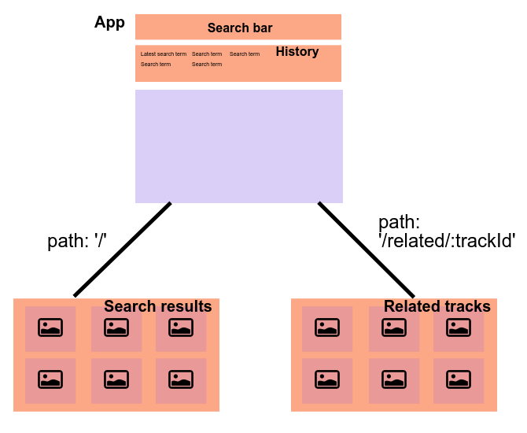

# React Training

Content
=======

This repository contains a step-by-step React tutorial. 
See branch `tutorial` for the actual steps. 

Aim of the tutorial
===================

First (steps 1.x), we build a vanilla React app which allows us to search for music tracks from [Last.fm](http://www.last.fm/). You need to [create a Last.fm/AudioScrobbler account](http://www.last.fm/api/account/create) and save the API key.
The app contains a search bar, a search history of previous searches, and a list of search results with artist name, picture, and track name. 

In the second part of the tutorial (steps 2.x), we refactor the app to use Redux for state management. 

In the third part (steps 3.x), we split the app into routes. The main route displays our initial page with search results. The subroute displays related tracks when we select one of the search results. 

In the fourth part (step 4.1), we add the test framework with Mocha, Chai, and Enzyme. 

Tools you may need
==================

* [Node and npm](https://nodejs.org/en/download/) for JavaScript package management. 
* [Git for Windows](https://git-scm.com/downloads) for version control and running `diff`s during the tutorial. 
* [Chrome Web browser](https://www.google.com/chrome/browser/desktop/index.html) and [React Dev Tools plugin](https://chrome.google.com/webstore/detail/react-developer-tools/fmkadmapgofadopljbjfkapdkoienihi) for React debugging. 
* Download this repo (either the zip or with `git clone`), execute `npm install`, and `npm start`. Visit [localhost:8080](http://localhost:8080) with your Chrome, confirm you see "I love React!", open React Dev Tools, and look under the hood. 

Reference material
==================

* [Babel](http://babeljs.io/) is a Javascript transpiler. Check out [Learn ES2015](http://babeljs.io/docs/learn-es2015/) for overview of ES6 features, and the [REPL](http://babeljs.io/repl/) for playing around with JSX and ES6 syntax. 
* [MDN JavaScript](https://developer.mozilla.org/en-US/docs/Web/JavaScript) is the go-to-place for all things JavaScript. Keep the [JavaScript language reference](https://developer.mozilla.org/en-US/docs/Web/JavaScript/Reference) under your pillow. 
* [React documentation](https://facebook.github.io/react/docs/getting-started.html) is quite decent. 
* [The official Redux docs](http://redux.js.org/) may be a little hard to approach. 

Steps
=====

The steps of the `tutorial` are tagged. 
You can follow the tutorial one step at a time, and run `git diff` to see how to get to the next step. 
For example, you may want to start by running `git diff -w HEAD 1.1-app-component`

See below for short description of each step. 

1.1-app-component
-----------------

Add a functional component for the React app. 

1.2-search-bar
--------------

Add search bar to the page.

1.3-component-state
-------------------

Add state to search bar by changing it into a managed component. 

1.4-app-state
-------------

Change App into a class-based component. Manage app state in App. Pass a callback function to SearchBar to allow updates to state. 

1.5-list-rendering 
------------------

Add component to show search history by rendering a list. Use ES5 map function of Array instance. 

1.6-rest-query
--------------

Fetch search results from AudioScrobbler API. Show results in Bootstrap panels. 

2.1-redux-actions
-----------------

Add Redux to project. Handle search with Redux action. Update search result list from Redux store. 

2.2-multiple-actions
--------------------

Remove global application state from App component. Add support for action creators with multiple actions. 

2.3-reuse-action
----------------

Allow click on history item to redo search. 

3.1-add-router
--------------

Add React Router to the project. 

3.2-reusable-result-list
------------------------

Refactor SearchResultList into a reusable functional component. 

3.3-add-subroute
----------------

Add subroute for displaying related tracks. 

3.4-route-action 
----------------

Change route when performing search. Use an action creator.

4.1-add-test
------------

Add Mocha, Chai and Enzyme for running tests. Define simple test for App rendering. 
